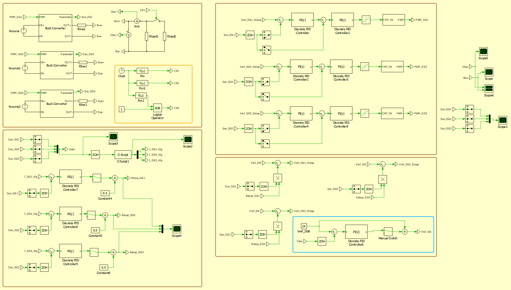

# Consensus-Based Current Sharing in DC Microgrids

## Report Overview
This report introduces a flexible consensus mechanism for current allocation in DC microgrids. Motivated by mismatched current sharing in droop-controlled systems due to line impedance variations, it integrates a discrete-time consensus algorithm with droop control to estimate current errors and adapt droop resistance. Simulations on a three-DG setup show a fast, oscillation-free startup (~15 ms) and robust recovery after a 0.3 s load step (~50 ms), while generator currents converge to a common setpoint in ~0.25 s with overshoot kept within limits. The results demonstrate improved power-sharing accuracy and better synchronization across units.

## Method Overview

## System Layout (PLEC)

## Repository Contents
- **Slides (PDF)**: [Consensus_Microgrid_Full_Presentation.pdf](./Consensus_Microgrid_Full_Presentation.pdf)
- **Figures**: `Overview_Method.png`, `Consensus_Microgrid_PLEC_Layout.png`
- **Code/Demo**: `Consensus_Microgrid_PLEC_Layout.png`

## Notes
- Droop control + discrete-time consensus for current error estimation.
- Robust to line impedance mismatch; fast convergence with limited overshoot.
